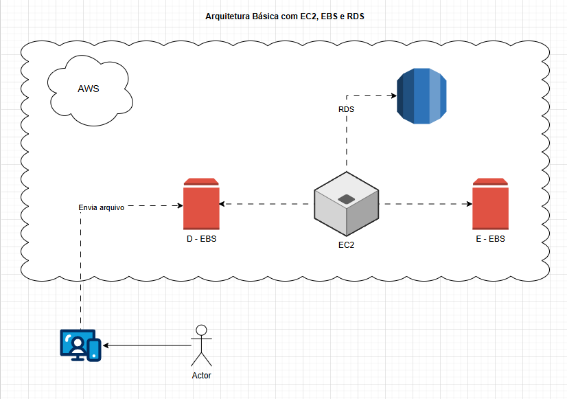
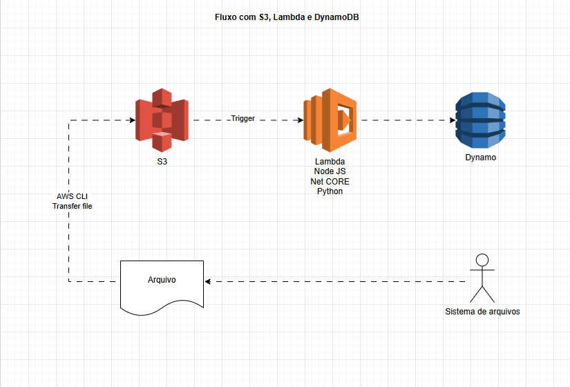

# Desafio AWS - DIO

Repositório criado para documentar os conhecimentos adquiridos durante o bootcamp GFT - Fundamentos de Cloud com AWS.

---

## Sobre o Bootcamp

Bootcamp realizado em parceria entre a DIO e a GFT com foco nos fundamentos da computação em nuvem utilizando AWS.

Durante as aulas foram abordados conceitos introdutórios sobre infraestrutura cloud, segurança, gerenciamento de usuários, controle de custos e serviços AWS.

---

## Conteúdos Estudados

### Introdução à AWS

- História da AWS
- Infraestrutura global
- Regiões AWS
- Zonas de disponibilidade
- Serviços gerenciados

### Segurança e Gerenciamento de Conta

- Criação de conta AWS
- Configuração de MFA
- IAM
- Usuários e grupos
- Políticas e permissões

### Controle de Custos

- Monitoramento de gastos
- Criação de alertas de cobrança

### Formas de Acesso

- AWS Console
- AWS CLI
- AWS CloudShell

### Amazon EC2

- O que são instâncias EC2
- Tipos de instâncias
- Otimização de recursos

### Armazenamento AWS

- Amazon EBS
- Amazon S3

---

## O Que Aprendi

Durante o bootcamp, aprendi conceitos fundamentais sobre computação em nuvem e os principais serviços introdutórios da AWS.

Entre os conhecimentos adquiridos, destacam-se:

- Funcionamento básico da AWS
- Estrutura global da AWS
- Diferença entre regiões e zonas de disponibilidade
- Boas práticas de segurança
- Configuração de MFA
- Gerenciamento de usuários e grupos com IAM
- Aplicação de políticas e permissões
- Controle e monitoramento de custos
- Formas de acesso à AWS utilizando Console, CLI e CloudShell
- Conceitos básicos sobre EC2, EBS e S3

---

## Diagramas Desenvolvidos

### Arquitetura com EC2, EBS e RDS

Diagrama reproduzido durante as aulas para demonstrar a integração entre serviços AWS.

---

### Arquitetura com S3, Lambda e DynamoDB

Exemplo de fluxo utilizando armazenamento em nuvem, processamento serverless e banco de dados.

---

## Conclusão

Este desafio ajudou a reforçar os conceitos básicos de computação em nuvem e apresentou alguns dos principais serviços da AWS.

Além do conteúdo teórico, também foi possível visualizar exemplos práticos de integração entre serviços e entender melhor como funciona a estrutura da AWS.
